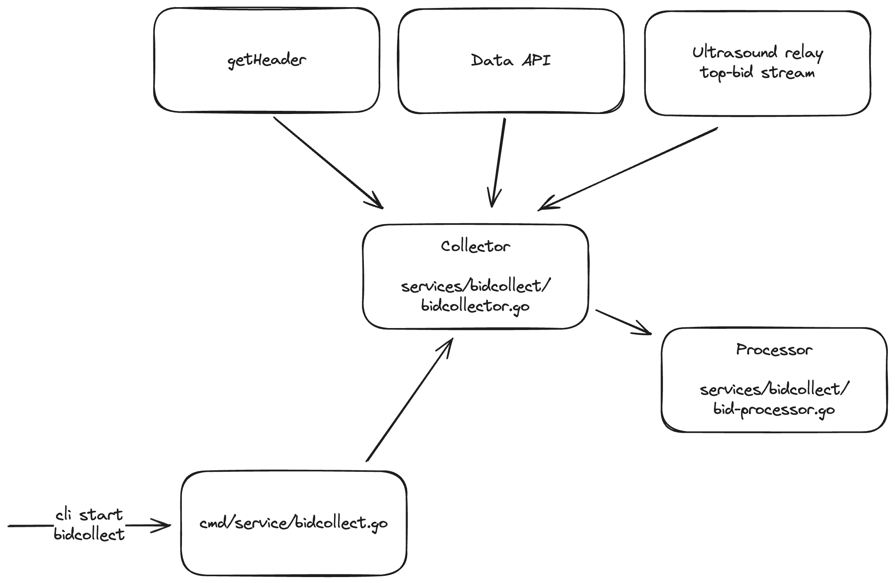

# Relayscan Bid Archive

Relayscan can run in a special bid-collection mode to build an archive of bids across [relays](../vars/relays.go).

Public bid archive: https://bidarchive.relayscan.io

---

### Bids source types

0. [getHeader polling](https://ethereum.github.io/builder-specs/#/Builder/getHeader)
1. [Data API polling](https://flashbots.github.io/relay-specs/#/Data/getReceivedBids)
2. [Ultrasound top-bid websocket stream](https://github.com/ultrasoundmoney/docs/blob/main/top-bid-websocket.md)

### Output

The output is (daily) CSV files:
1. All bids
2. Top bids only


### Collected fields

| Field                  | Description                                            | Source Types |
| ---------------------- | ------------------------------------------------------ | ------------ |
| source_type            | 0: getHeader, 1: Data API, 2: Ultrasound stream        | all          |
| received_at_ms         | Timestamp when the bid was first seen at the collector | all          |
| timestamp_ms           | Timestamp when the bid was received by the relay       | 1 + 2        |
| slot                   | Slot the bid was submitted for                         | all          |
| slot_t_ms              | Slot timestamp                                         | all          |
| value                  | Bid value in wei                                       | all          |
| block_hash             | Block hash                                             | all          |
| parent_hash            | Parent hash                                            | all          |
| builder_pubkey         | Builder pubkey                                         | 1 + 2        |
| block_number           | Block number                                           | all          |
| block_fee_recipient    | Block fee recipient                                    | all          |
| relay                  | Relay name                                             | all          |
| proposer_pubkey        | Proposer pubkey                                        | 1 + 2        |
| proposer_fee_recipient | Proposer fee recipient                                 | 1 + 2        |
| optimistic_submission  | Optimistic submission flag                             | 0 + 1        |

### See also

- Live data: https://bidarchive.relayscan.io
- [Pull request #37](https://github.com/flashbots/relayscan/pull/37)
- [Example output](https://gist.github.com/metachris/061c0443afb8b8d07eed477a848fa395)

---

## Notes on data sources

Source types:
- `0`: `getHeader` polling
- `1`: Data API polling
- `2`: Ultrasound top-bid Websockets stream

Different data sources have different limitations:

- `getHeader` polling ([code](/services/bidcollect/getheader-poller.go)):
  - The received header only has limited information, with these implications:
    - Optimistic is always `false`
    - No `builder_pubkey`
    - No bid timestamp (need to use receive timestamp)
    - getHeader bid timestamps are always when the response from polling at t=1s comes back (but not when the bid was received at a relay)
  - Some relays only allow a single `getHeader` request per slot, so we time it at `t=1s`
- Data API polling ([code](/services/bidcollect/data-api-poller.go):
    - Has all the necessary information
    - Due to rate limits, we only poll at specific times
    - Polling at t-4, t-2, t-0.5, t+0.5, t+2 (see also [`/services/bidcollect/data-api-poller.go`](/services/bidcollect/data-api-poller.go#64-69))
- Ultrasound websocket stream ([code](/services/bidcollect/ultrasound-stream.go):
  - doesn't expose optimistic, thus that field is always `false`

## Other notes

- Bids are deduplicated based on this key:
  - `fmt.Sprintf("%d-%s-%s-%s-%s", bid.Slot, bid.BlockHash, bid.ParentHash, bid.BuilderPubkey, bid.Value)`
  - this means only the first bid for a given key is stored, even if - for instance - other relays also deliver the same bid

---

## Running it

By default, the collector will output CSV into `<outdir>/<date>/<filename>.csv`

```bash
# Start data API and ultrasound stream collectors
go run . service bidcollect --data-api --ultrasound-stream --all-relays

# getHeader needs a beacon node too
go run . service bidcollect --get-header --beacon-uri http://localhost:3500 --all-relays
```

---

## Useful Clickhouse queries

Useful [clickhouse-local](https://clickhouse.com/docs/en/operations/utilities/clickhouse-local) queries:

```bash
$ clickhouse local -q "SELECT source_type, COUNT(source_type) FROM '2024-06-12_top.csv' GROUP BY source_type ORDER BY source_type;"
0       2929
1       21249
2       1057722

# Get bids > 1 ETH for specific builders (CSV has 10M rows)
$ time clickhouse local -q "SELECT count(value), quantile(0.5)(value) as p50, quantile(0.75)(value) as p75, quantile(0.9)(value) as p90, max(value) FROM '2024-06-05_all.csv' WHERE value > 1000000000000000000 AND builder_pubkey IN ('0xa01a00479f1fa442a8ebadb352be69091d07b0c0a733fae9166dae1b83179e326a968717da175c7363cd5a13e8580e8d', '0xa02a0054ea4ba422c88baccfdb1f43b2c805f01d1475335ea6647f69032da847a41c0e23796c6bed39b0ee11ab9772c6', '0xa03a000b0e3d1dc008f6075a1b1af24e6890bd674c26235ce95ac06e86f2bd3ccf4391df461b9e5d3ca654ef6b9e1ceb') FORMAT TabSeparatedWithNames;"
count(value)    p50     p75     p90     max(value)
1842    1789830446982354000     2279820737908906200     4041286254343376400     8216794401676997763

real    0m2.202s
user    0m17.320s
sys     0m0.589s
```

---

## Architecture




---

## TODO

- Dockerization